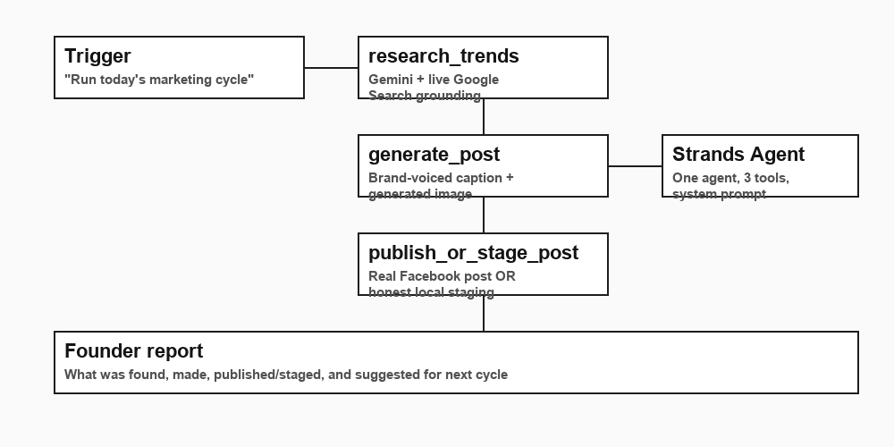

# GTLingo Marketing Agent

**An autonomous social-media manager for a small business — built for the [Agents for Humans Hackathon](https://agentsforhumans.devpost.com/) (Amazon, Strands Agents SDK), Professional Agents track.**

Not another app to check. This agent runs in the background, researches what's actually happening right now relevant to the brand, writes and generates a real post in the brand's voice, publishes it (or stages it for approval when live publishing isn't wired up yet), and reports back — the founder only needs to read the summary, not manage the process.

Demo business: **[GTLingo](https://github.com/RolexAlexander/GTLingo)** — a real Rolex Alexander product, a Guyanese Creolese translation companion app. See [`marketing_agent/brand_profile.py`](marketing_agent/brand_profile.py) — this is swappable for any business, not hard-coded logic.

## Architecture



## How it works

```
"Run today's marketing cycle"
        |
        v
+---------------------+
|  research_trends      |  Gemini + live Google Search grounding --
|                        |  real current findings, not the model's
|                        |  training-data guesses
+---------------------+
        |
        v
+---------------------+
|  generate_post         |  brand-voiced caption + a real generated
|                         |  image (Gemini native image model),
|                         |  grounded in the trend research above
+---------------------+
        |
        v
+---------------------+
|  publish_or_stage_post  |  REAL Facebook Page post via direct
|                         |  multipart image upload -- or stages
|                         |  locally for approval if credentials
|                         |  aren't configured
+---------------------+
        |
        v
   a short, direct founder update
```

Built on the **Strands Agents SDK** (`Agent(model=..., tools=[...])`) -- one agent, three real tools, a system prompt that tells it to run the whole cycle autonomously and report back like a competent employee, not narrate every step.

## Why Facebook posting is real today and Instagram isn't yet

Facebook's Graph API (`/​{page-id}/photos`) accepts a direct binary file upload -- no public image hosting required, which means it's genuinely live-postable today with just a Page Access Token and Page ID. Instagram's Content Publishing API requires the image to already be at a public URL, which needs an image-hosting piece this build doesn't have yet. Rather than fake it or silently skip Instagram, the tool is honest: it stages Instagram-bound content the same way it stages anything without live credentials, clearly labeled, ready for the deepening pass to wire up real hosting.

## Running it

```bash
pip install -r requirements.txt
cp .env.example .env   # fill in GOOGLE_API_KEY at minimum
python main.py
```

Add `META_PAGE_ACCESS_TOKEN` and `META_PAGE_ID` to attempt a real Facebook post; leave them blank and every post stages locally to `output/staged_posts/` instead. Set `MARKETING_MOCK=1` to run the whole cycle without any API spend.

### Testing without spending anything

```bash
python -m unittest tests.test_publish_post -v
```

Mocks the network layer entirely and verifies the Facebook Graph API integration against the real, documented endpoint shape (`POST /{page-id}/photos`, multipart `source` file + `caption` + `access_token`) before any real post is attempted.

## Model backend: Gemini today, Bedrock is the upgrade

This build uses `strands.models.gemini.GeminiModel` so it's testable immediately with an existing Gemini API key. The hackathon's own judging notes that deploying via **Amazon Bedrock AgentCore strengthens the technical score** (optional, not required) -- swapping to `strands.models.bedrock.BedrockModel` is a one-line change in [`marketing_agent/agent.py`](marketing_agent/agent.py). Not done for this submission -- AWS/Bedrock model-access setup takes real time this submission's deadline didn't allow for, and a working Gemini-backed agent beats an unfinished Bedrock one. Documented here plainly rather than claimed as done.

## Real run

See [`docs/final-demo-run.md`](docs/final-demo-run.md) for a full real, live end-to-end cycle -- real trend research, real generated content, correctly staged output, and the actual founder-facing report, including the generated image.

## What's built vs. what's next

**Built:**
- Full autonomous cycle, verified live: real trend research (Google Search grounding), real content generation (caption + generated image), real Facebook publishing capability (or honest staging when credentials aren't configured), a founder-facing report that includes the agent's own suggestion for the next cycle.
- Verified integrations: Google Search grounding syntax and the Facebook Graph API request shape, both checked against real documentation/SDK types before spending anything, plus one full real run end to end.

**Next:**
- Instagram publishing (needs public image hosting -- e.g. a small Cloudflare R2/S3 bucket).
- Swap to Bedrock/AgentCore for the stronger technical score, once there's time to set up AWS access properly.
- True autonomy: scheduled/recurring cycles rather than one manual run, and a memory of past posts so the agent doesn't repeat content pillars or contradict earlier posts.
- Real engagement-metric feedback (Graph API Insights) closing the loop on "what actually worked," not just "what got published."

## License

MIT — see [`LICENSE`](LICENSE).
